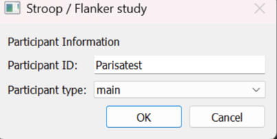
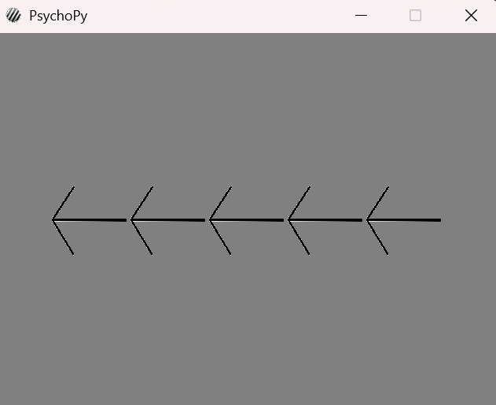
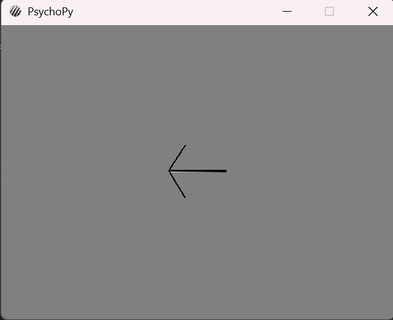
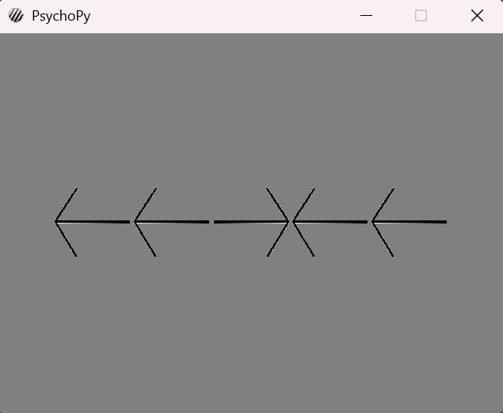
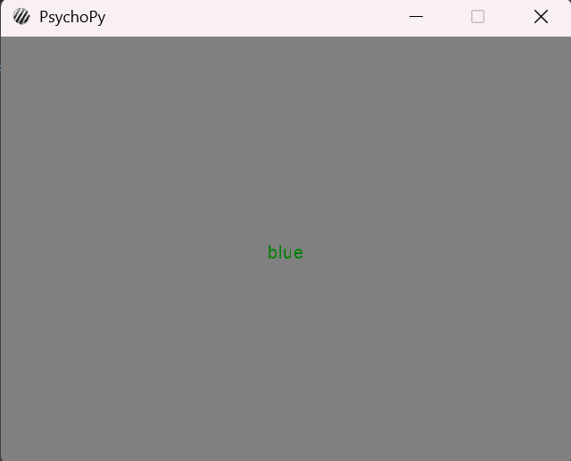
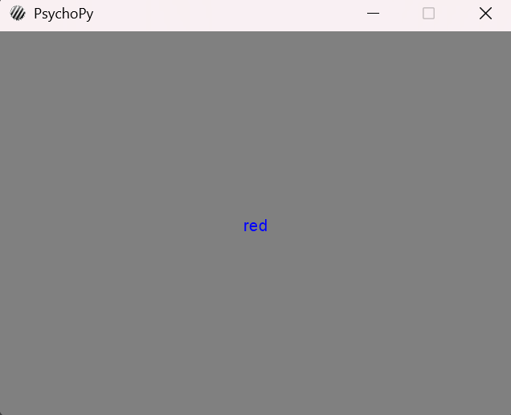
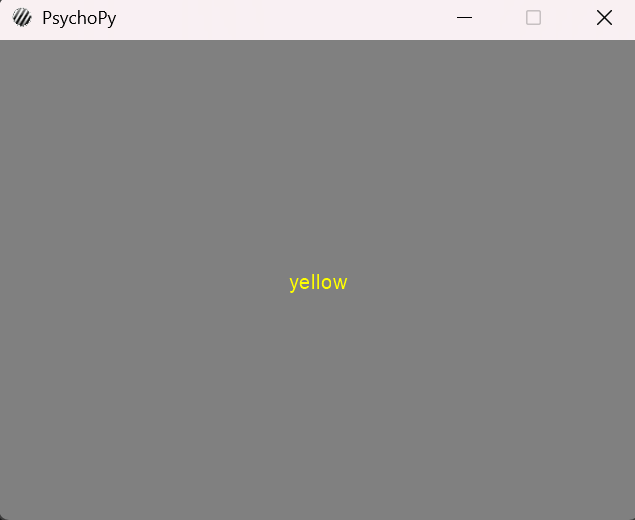

# Flanker-Stroop Experiment with PsychoPy

This is a simple Flanker-Stroop experiment, which I have coded as a project for the course **"Building an Experiment in Python"**.  
For this project, I have used *"PsychoPy"*, which is an open-source Python package.

---

### Overview
First, the experimenter should enter the participant's ID and choose the project:

---

### Flanker Part
In the Flanker part of the experiment, participants are shown a series of trials. For example:

  
  

After completing the Flanker block, the participant receives a message that the next block is starting:

---

### Stroop Part
In the Stroop part of the experiment, participants are shown tasks involving color-word conflict. For example:

  
  

